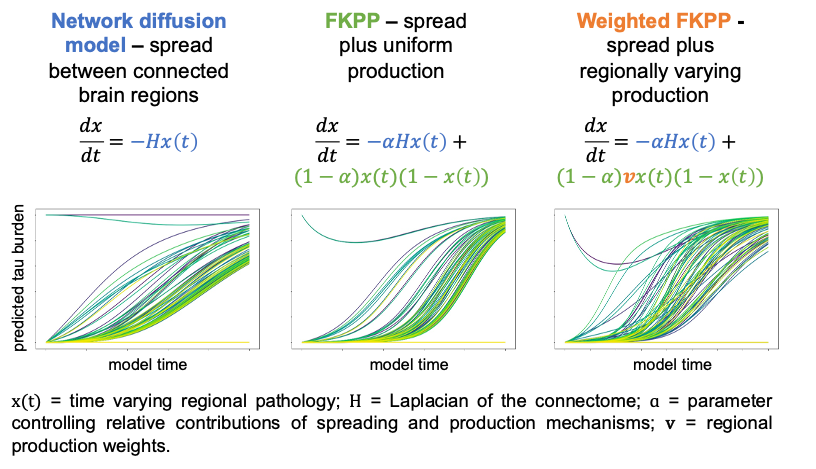

## Network Spreading Models Toolbox
Connectome-based models of disease propagation are used to probe mechanisms of
pathology spread in neurodegenerative disease. We present our network spreading model toolbox that allows the user to compare model fits across different models and parameters.

## Available models
Network Diffusion Model (NDM), Fisher-Kolmogorov-Petrovsky-Piscounov (FKPP), and weighted-FKPP are currently available in the toolbox. Equations and simulated pathology over time are provided in the figure below:

## Get started
Run [NDM_optimisation_spreading_data.py](./code/NDM_optimisation_spreading_data.py) or [FKPP_optimisation_spreading_data.py](./code/FKPP_optimisation_spreading_data.py) to run example code for the NDM or the FKPP models. This selects optimal model parameters for each model using a simulated dataset.

## About us
This toolbox originated from project for CMICHACKS 2023.
The team included: Ellie, Anna, Tiantian, Neil, James, Antoine and Xin

